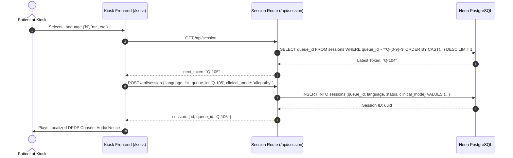
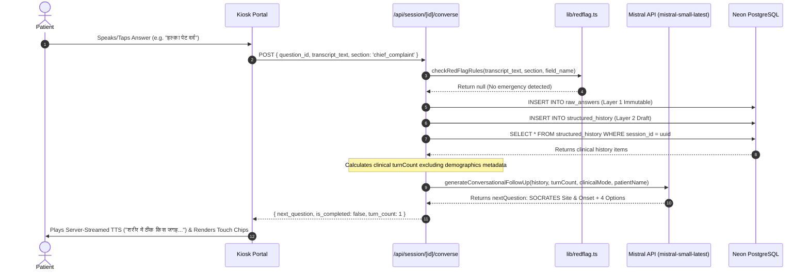
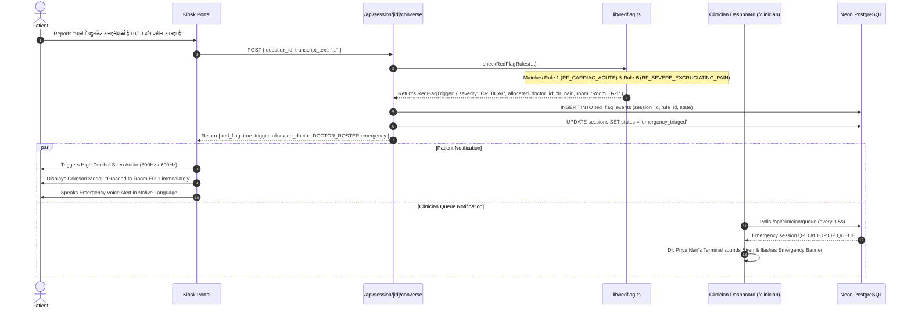
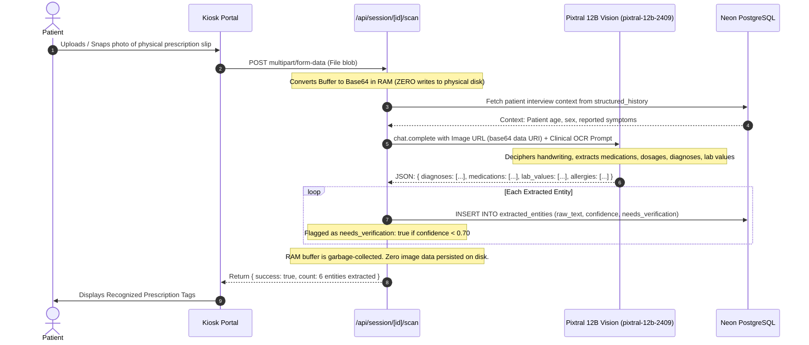
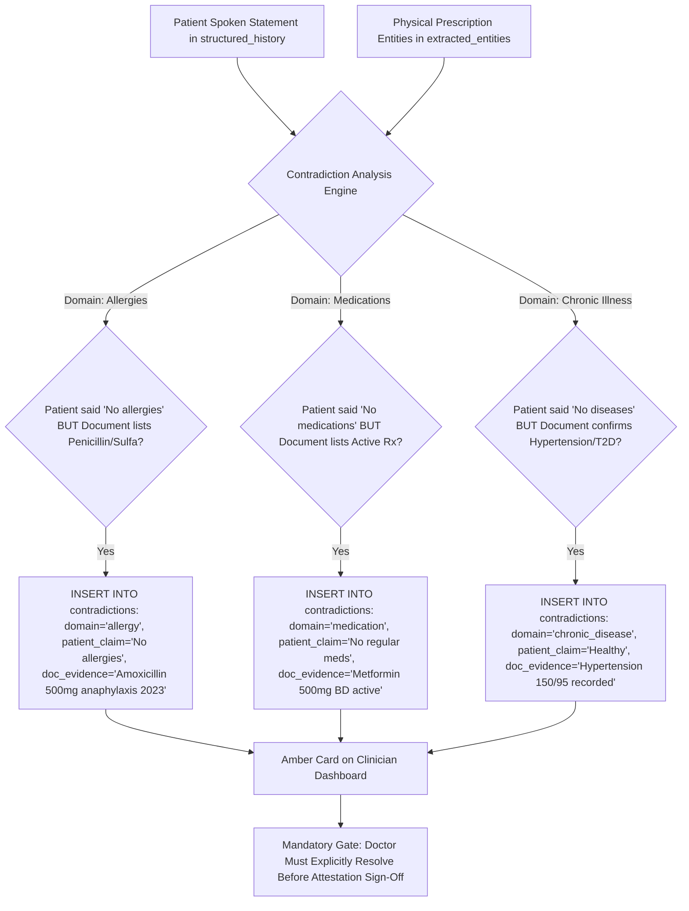
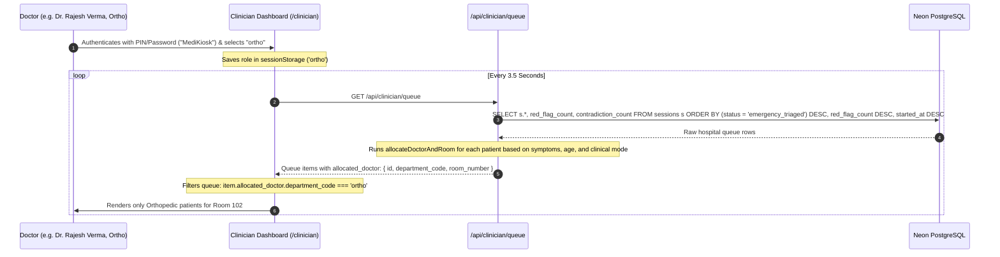
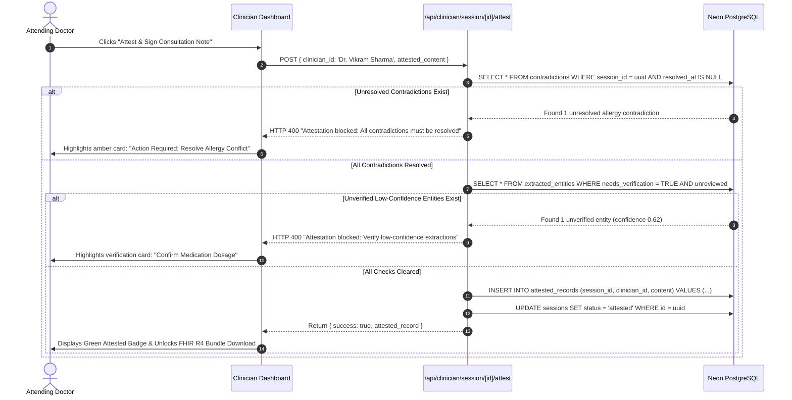
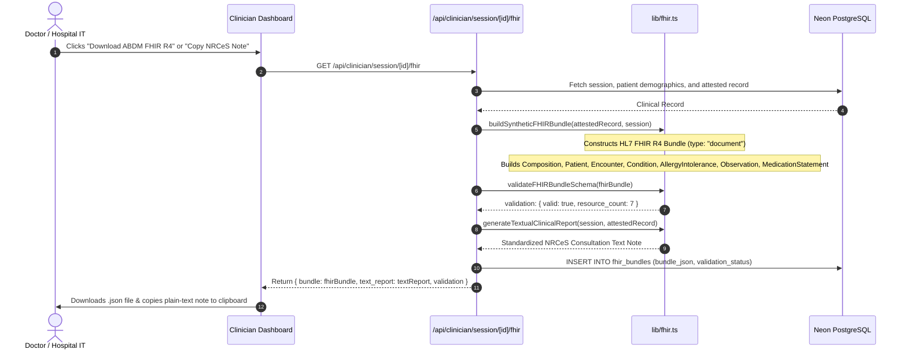

# MediKiosk: Comprehensive Technical Architecture, System Workflows & Engineering Specification

**End-to-End Technical Deep Dive into the Multilingual Voice AI OPD Triage & Clinical Review Engine**
*Compliant with DPDP 2023, ABDM FHIR R4, and Ministry of AYUSH Standards.*

---

## 1. System Overview & Technology Stack

MediKiosk is built on an enterprise-grade, high-concurrency, asynchronous web architecture designed for low-latency voice intake, zero-disk multimodal document parsing, deterministic clinical emergency triaging, and FHIR R4 interoperability.

```
+-----------------------------------------------------------------------------------------------+
|                                     CLIENT APPLICATION LAYER                                  |
|  Next.js 15.1 (React 19, TypeScript 5.7, Tailwind CSS 4.0, Framer Motion)                    |
|  - Patient Kiosk Portal (/kiosk)        - Clinician Review Dashboard (/clinician)             |
|  - Web Speech API (STT Voice Loop)      - Dual-Tier TTS (Browser SpeechSynthesis + Server TTS) |
+-----------------------------------------------+-----------------------------------------------+
                                                | HTTPS / JSON / Multipart
                                                v
+-----------------------------------------------------------------------------------------------+
|                                    NEXT.JS API ROUTE ENGINE                                   |
|  Node.js 20+ Serverless / Edge Runtime                                                        |
|  - Session & Token Controller (/api/session)                                                  |
|  - Conversational Follow-Up Agent (/api/session/[id]/converse)                                |
|  - Zero-Disk Vision Scanner (/api/session/[id]/scan)                                          |
|  - Live Bilingual Summarizer (/api/session/[id]/summary)                                      |
|  - Clinician Queue & Triage (/api/clinician/queue)                                            |
|  - Attestation & FHIR Bundler (/api/clinician/session/[id]/attest & /fhir)                    |
|  - Regional Audio Proxy Streamer (/api/tts)                                                   |
+----------------------+------------------------+-----------------------------------------------+
                       |                        |
        +--------------+                        +--------------+
        | API Payloads / Prompts                               | Parameterized SQL (Pooler)
        v                                                      v
+---------------------------------------+   +---------------------------------------------------+
|            MISTRAL AI CLOUD           |   |       NEON SERVERLESS POSTGRESQL DATABASE         |
|  - mistral-small-latest               |   |  - Layer 1: Immutable Patient Evidence Layer      |
|    (SOCRATES Reasoning & Summaries)   |   |  - Layer 2: Mutable AI Intake Draft Layer         |
|  - pixtral-12b-2409                   |   |  - Layer 3: Legally Binding Attested Layer        |
|    (Multimodal Zero-Disk Vision OCR)  |   |  Connection Pooling • SSL Require • Foreign Keys  |
+---------------------------------------+   +---------------------------------------------------+
```

### 1.1 Complete Technology Stack

| Layer                       | Technology                 | Version                             | Purpose in Architecture                                                                        |
| :-------------------------- | :------------------------- | :---------------------------------- | :--------------------------------------------------------------------------------------------- |
| **Framework**         | Next.js (App Router)       | `15.1.11`                         | Full-stack server and client framework with hybrid server-rendered pages and API routes.       |
| **UI Library**        | React                      | `19.0.0`                          | Component lifecycle, reactive state, and concurrent rendering.                                 |
| **Language**          | TypeScript                 | `5.7.0`                           | Strict type checking for clinical schemas, FHIR bundles, and database rows.                    |
| **Styling**           | Tailwind CSS               | `4.0.0`                           | Modern utility classes with custom HSL and CSS variable design tokens.                         |
| **Animation**         | Framer Motion              | `13.2.0`                          | Micro-interactions, pulsing listening states, and smooth modal transitions.                    |
| **Database**          | Neon Serverless PostgreSQL | `@neondatabase/serverless 0.10.4` | Scalable PostgreSQL database with serverless connection pooling and sub-50ms queries.          |
| **Conversational AI** | Mistral Small              | `mistral-small-latest`            | Employs chain-of-thought clinical prompting for multi-turn SOCRATES intake and SBAR summaries. |
| **Vision AI**         | Pixtral 12B Vision         | `pixtral-12b-2409`                | High-accuracy multimodal OCR and clinical entity extraction directly from base64 RAM buffers.  |
| **Speech-to-Text**    | Web Speech API             | Native Browser                      | Zero-latency browser speech recognition with BCP-47 regional Indian language tags.             |
| **Text-to-Speech**    | Google Translate TTS Proxy | Dual-tier (`/api/tts`)            | Server-streamed audio endpoint providing natural regional vernacular speech for 10 languages.  |
| **Audio Synthesis**   | Web Audio API              | Native Browser                      | Procedural synthesis of 800Hz/600Hz emergency sirens and 523Hz/659Hz hospital chimes.          |

---

## 2. Three-Tier Data Separation Model (Compliance & Liability Architecture)

To comply with the **Digital Personal Data Protection Act (DPDP 2023)** and safeguard hospital medical liability, MediKiosk enforces strict architectural isolation between three separate data tiers:

```
+---------------------------------------------------------------------------------------+
| LAYER 1: PATIENT EVIDENCE LAYER (IMMUTABLE)                                           |
| "What the patient actually said, tapped, or uploaded"                                 |
| - sessions: Master record, language, queue token, clinical mode                       |
| - consent_records: Legal DPDP consent artifact (touch/voice/guardian)                |
| - raw_answers: Verbatim audio transcripts, selected chips, confidence                |
| - document_uploads: Metadata & quality check results (NO image bytes saved to disk)   |
| CONSTRAINT: INSERT ONLY. Once committed, records are NEVER updated or overwritten.    |
+-------------------------------------------+-------------------------------------------+
                                            |
                                            v Feeds AI Engine
+---------------------------------------------------------------------------------------+
| LAYER 2: INTAKE DRAFT LAYER (AI-GENERATED & MUTABLE)                                  |
| "AI-synthesized clinical interpretations & extracted entities"                        |
| - structured_history: SOCRATES slots, chronic illness, allergies, family history      |
| - extracted_entities: Pixtral vision extractions (diagnoses, medications, lab values) |
| - draft_summaries: Bilingual Patient Summary & Clinician SBAR Draft                   |
| - contradictions: Flagged discrepancies between patient speech and physical documents  |
| CONSTRAINT: Explicitly marked as UNVERIFIED / DRAFT. Never used for automated care.  |
+-------------------------------------------+-------------------------------------------+
                                            |
                                            v Physician Review & Verification
+---------------------------------------------------------------------------------------+
| LAYER 3: CLINICIAN-ATTESTED LAYER (LEGALLY BINDING)                                   |
| "Human doctor verified clinical record and authorized EHR export"                    |
| - review_actions: Audit trail of doctor edits, verification clicks, and resolutions  |
| - attested_records: Final signed clinical summary with doctor ID and timestamp       |
| - fhir_bundles: Validated HL7 FHIR R4 JSON document bundles for ABDM HIE exchange    |
| - audit_log: Immutable cryptographic audit trail of all access and modifications      |
| CONSTRAINT: Only Layer 3 data is exported to hospital EHRs and ABDM repositories.    |
+---------------------------------------------------------------------------------------+
```

---

## 3. Database Schema & Table Definitions (Neon PostgreSQL)

```sql
-- 1. SESSIONS (Master tracking table)
CREATE TABLE sessions (
  id UUID PRIMARY KEY DEFAULT gen_random_uuid(),
  queue_id VARCHAR(50) NOT NULL,
  patient_ref VARCHAR(100) NOT NULL DEFAULT 'PATIENT_GUEST',
  patient_name VARCHAR(255),
  age INTEGER,
  gender VARCHAR(20),
  clinical_mode VARCHAR(50) DEFAULT 'allopathy', -- 'allopathy' | 'ayurveda'
  abha_mock_id VARCHAR(100),
  language VARCHAR(10) NOT NULL DEFAULT 'hi',
  status VARCHAR(50) NOT NULL DEFAULT 'in_progress', -- 'in_progress' | 'emergency_triaged' | 'completed' | 'attested'
  started_at TIMESTAMPTZ NOT NULL DEFAULT NOW(),
  ended_at TIMESTAMPTZ
);

-- 2. CONSENT RECORDS (Layer 1: DPDP Legal Consent)
CREATE TABLE consent_records (
  id UUID PRIMARY KEY DEFAULT gen_random_uuid(),
  session_id UUID NOT NULL REFERENCES sessions(id) ON DELETE CASCADE,
  consent_given BOOLEAN NOT NULL DEFAULT TRUE,
  method VARCHAR(20) NOT NULL DEFAULT 'touch', -- 'touch' | 'voice' | 'guardian'
  language VARCHAR(10) NOT NULL DEFAULT 'hi',
  notice_version VARCHAR(50) NOT NULL DEFAULT 'v1.0',
  recorded_at TIMESTAMPTZ NOT NULL DEFAULT NOW()
);

-- 3. RAW ANSWERS (Layer 1: Immutable Patient Evidence)
CREATE TABLE raw_answers (
  id UUID PRIMARY KEY DEFAULT gen_random_uuid(),
  session_id UUID NOT NULL REFERENCES sessions(id) ON DELETE CASCADE,
  question_id VARCHAR(100) NOT NULL,
  source_mode VARCHAR(20) NOT NULL DEFAULT 'touch', -- 'touch' | 'voice'
  transcript_text TEXT NOT NULL,
  confidence NUMERIC(4, 3) NOT NULL DEFAULT 0.950,
  recorded_at TIMESTAMPTZ NOT NULL DEFAULT NOW()
);

-- 4. STRUCTURED HISTORY (Layer 2: Standardized Clinical Intake Slots)
CREATE TABLE structured_history (
  id UUID PRIMARY KEY DEFAULT gen_random_uuid(),
  session_id UUID NOT NULL REFERENCES sessions(id) ON DELETE CASCADE,
  section VARCHAR(100) NOT NULL, -- 'chief_complaint' | 'hpi' | 'past_history' | 'medications' | 'allergies' | 'family_history' | 'ayush_profile'
  field_name VARCHAR(100) NOT NULL,
  value TEXT NOT NULL,
  source_raw_answer_id UUID REFERENCES raw_answers(id),
  confidence NUMERIC(4, 3) NOT NULL DEFAULT 0.950
);

-- 5. RED FLAG EVENTS (Deterministic Emergency Safety Log)
CREATE TABLE red_flag_events (
  id UUID PRIMARY KEY DEFAULT gen_random_uuid(),
  session_id UUID NOT NULL REFERENCES sessions(id) ON DELETE CASCADE,
  rule_id VARCHAR(100) NOT NULL, -- e.g. 'RF_CARDIAC_ACUTE', 'RF_STROKE_FAST', 'RF_HEMORRHAGE_ACUTE'
  session_state_at_trigger JSONB,
  triggered_at TIMESTAMPTZ NOT NULL DEFAULT NOW()
);

-- 6. DOCUMENT UPLOADS (Layer 1: Zero-Disk Extraction Metadata)
CREATE TABLE document_uploads (
  id UUID PRIMARY KEY DEFAULT gen_random_uuid(),
  session_id UUID NOT NULL REFERENCES sessions(id) ON DELETE CASCADE,
  file_ref VARCHAR(255) NOT NULL, -- RAM buffer reference; no image files stored on disk
  mime_type VARCHAR(50) NOT NULL DEFAULT 'image/jpeg',
  quality_check_result VARCHAR(50) DEFAULT 'PASSED',
  uploaded_at TIMESTAMPTZ NOT NULL DEFAULT NOW()
);

-- 7. EXTRACTED ENTITIES (Layer 2: Vision AI Entity Extractions)
CREATE TABLE extracted_entities (
  id UUID PRIMARY KEY DEFAULT gen_random_uuid(),
  session_id UUID NOT NULL REFERENCES sessions(id) ON DELETE CASCADE,
  source_doc_id UUID REFERENCES document_uploads(id) ON DELETE SET NULL,
  entity_type VARCHAR(50) NOT NULL, -- 'medication' | 'diagnosis' | 'lab_value' | 'allergy'
  raw_text TEXT NOT NULL,
  confidence NUMERIC(4, 3) NOT NULL DEFAULT 0.850,
  needs_verification BOOLEAN NOT NULL DEFAULT FALSE, -- TRUE if confidence < 0.70
  fields JSONB DEFAULT '{}'::jsonb
);

-- 8. DRAFT SUMMARIES (Layer 2: SBAR & Patient Summaries)
CREATE TABLE draft_summaries (
  id UUID PRIMARY KEY DEFAULT gen_random_uuid(),
  session_id UUID NOT NULL REFERENCES sessions(id) ON DELETE CASCADE,
  model_name VARCHAR(100) NOT NULL DEFAULT 'mistral-small-latest',
  model_version VARCHAR(50) NOT NULL DEFAULT 'v1.0',
  prompt_version VARCHAR(50) NOT NULL DEFAULT 'p1.0',
  content JSONB NOT NULL,
  input_hash VARCHAR(255) NOT NULL,
  generated_at TIMESTAMPTZ NOT NULL DEFAULT NOW()
);

-- 9. CONTRADICTIONS (Layer 2: Patient Spoke vs Document Stated Discrepancies)
CREATE TABLE contradictions (
  id UUID PRIMARY KEY DEFAULT gen_random_uuid(),
  session_id UUID NOT NULL REFERENCES sessions(id) ON DELETE CASCADE,
  domain VARCHAR(100) NOT NULL, -- 'allergy' | 'medication' | 'chronic_disease'
  patient_claim TEXT NOT NULL,
  document_evidence TEXT NOT NULL,
  source_doc_id UUID REFERENCES document_uploads(id) ON DELETE SET NULL,
  detected_at TIMESTAMPTZ NOT NULL DEFAULT NOW(),
  resolution_action VARCHAR(50), -- 'accepted_patient' | 'accepted_document' | 'clinician_override'
  resolution_reason TEXT,
  resolved_at TIMESTAMPTZ,
  resolved_by VARCHAR(100)
);

-- 10. REVIEW ACTIONS (Layer 3: Physician Edit & Verification Ledger)
CREATE TABLE review_actions (
  id UUID PRIMARY KEY DEFAULT gen_random_uuid(),
  session_id UUID NOT NULL REFERENCES sessions(id) ON DELETE CASCADE,
  clinician_id VARCHAR(100) NOT NULL,
  action_type VARCHAR(50) NOT NULL, -- 'verified_entity' | 'edited_field' | 'resolved_contradiction'
  field_ref VARCHAR(255),
  original_value TEXT,
  new_value TEXT,
  acted_at TIMESTAMPTZ NOT NULL DEFAULT NOW()
);

-- 11. ATTESTED RECORDS (Layer 3: Legally Signed Consultation Record)
CREATE TABLE attested_records (
  id UUID PRIMARY KEY DEFAULT gen_random_uuid(),
  session_id UUID NOT NULL REFERENCES sessions(id) ON DELETE CASCADE,
  clinician_id VARCHAR(100) NOT NULL,
  content JSONB NOT NULL,
  attested_at TIMESTAMPTZ NOT NULL DEFAULT NOW()
);

-- 12. FHIR BUNDLES (Layer 3: ABDM HL7 FHIR R4 Export Repository)
CREATE TABLE fhir_bundles (
  id UUID PRIMARY KEY DEFAULT gen_random_uuid(),
  session_id UUID NOT NULL REFERENCES sessions(id) ON DELETE CASCADE,
  attested_record_id UUID REFERENCES attested_records(id) ON DELETE SET NULL,
  bundle_type VARCHAR(50) NOT NULL DEFAULT 'document',
  bundle_json JSONB NOT NULL,
  validation_status VARCHAR(50) NOT NULL DEFAULT 'valid',
  created_at TIMESTAMPTZ NOT NULL DEFAULT NOW()
);
```

---

## 4. End-to-End System Workflows & Sequence Diagrams

### Workflow 1: Sequential Hospital Queue Token Generation & Session Init



---

### Workflow 2: Adaptive Multi-Turn SOCRATES Intake & Turn Orchestration



---

### Workflow 3: Deterministic Emergency Red-Flag Interception & Escalation



---

### Workflow 4: Zero-Disk Multimodal Document Extraction (Pixtral 12B Vision in RAM)



---

### Workflow 5: Contradiction Detection Algorithm

MediKiosk runs a dual-layer contradiction analysis comparing the Patient Evidence Layer (spoken history) against the Pixtral Vision extractions:



---

### Workflow 6: Live Doctor Queue Polling & Department Privacy Isolation



---

### Workflow 7: Verification Gates & Legal Physician Attestation



---

### Workflow 8: ABDM HL7 FHIR R4 Bundle & NRCeS Note Generation



---

## 5. Intelligent Doctor & Room Allocation Algorithm

The allocation algorithm (`allocateDoctorAndRoom` in `lib/doctors.ts`) deterministically assigns every patient to the appropriate physician and room based on **severity, age, clinical intake mode, and reported symptoms**:

```
                                  [Patient Inflow]
                                         │
                          Is Red Flag > 0 OR Emergency?
                                  /            \
                             YES /              \ NO
                                v                v
                  [Dr. Priya Nair (ER-1)]    Is clinical_mode == 'ayurveda'?
                  Emergency Resuscitation         /            \
                                             YES /              \ NO
                                                v                v
                                    [Dr. Harish Vaidya]      Is age < 14?
                                      Room 108 (AYUSH)         /     \
                                                          YES /       \ NO
                                                             v         v
                                                    [Dr. Ananya Sen]  Orthopedic Keywords?
                                                     Room 105 (Pedia)  (fracture, joint, bone, knee)
                                                                           /          \
                                                                      YES /            \ NO
                                                                         v              v
                                                               [Dr. Rajesh Verma]  [Dr. Vikram Sharma]
                                                                Room 102 (Ortho)    Room 101 (General OPD)
```

### Complete Doctor Roster Specifications

| Doctor Name                 | Qualification                      | Specialty                          | Department Code | Assigned Room       | Floor / Location               | Avg Consult            | Theme Color                  |
| :-------------------------- | :--------------------------------- | :--------------------------------- | :-------------- | :------------------ | :----------------------------- | :--------------------- | :--------------------------- |
| **Dr. Priya Nair**    | MBBS, MEM (Emergency & Trauma)     | Emergency Medicine & Critical Care | `emergency`   | **Room ER-1** | Ground Floor, Emergency Wing   | 0 min (Immediate STAT) | Crimson / Rose (`#DC2626`) |
| **Dr. Vikram Sharma** | MBBS, MD (General Medicine)        | General Medicine & Adult OPD       | `general`     | **Room 101**  | Ground Floor, Central Corridor | 8 min                  | Pine Teal (`#004D47`)      |
| **Dr. Rajesh Verma**  | MBBS, MS (Orthopedics)             | Orthopedics & Joint Care           | `ortho`       | **Room 102**  | 1st Floor, Corridor B          | 10 min                 | Indigo (`#4F46E5`)         |
| **Dr. Ananya Sen**    | MBBS, MD (Pediatrics), DCH         | Pediatrics & Child Health          | `pedia`       | **Room 105**  | 1st Floor, Child Care Wing     | 8 min                  | Purple (`#9333EA`)         |
| **Dr. Harish Vaidya** | BAMS, MD (Ayurveda - Kayachikitsa) | Ayurvedic Medicine & Panchakarma   | `ayush`       | **Room 108**  | 2nd Floor, AYUSH Wing          | 12 min                 | Emerald (`#059669`)        |

---

## 6. Comprehensive API Endpoint Reference

### 1. `GET /api/session`

- **Purpose**: Calculates the next continuous sequential queue token.
- **SQL Executed**:
  ```sql
  SELECT queue_id FROM sessions WHERE queue_id ~ '^Q-[0-9]+$' 
  ORDER BY CAST(SUBSTRING(queue_id FROM 3) AS INTEGER) DESC LIMIT 1
  ```
- **Response**: `{ "success": true, "next_token": "Q-105" }`

### 2. `POST /api/session`

- **Purpose**: Initializes a new patient kiosk session.
- **Request Body**:
  ```json
  { "language": "hi", "queue_id": "Q-105", "clinical_mode": "allopathy", "abha_mock_id": null }
  ```
- **Response**: `{ "success": true, "session": { "id": "uuid", "queue_id": "Q-105", "status": "in_progress" } }`

### 3. `PATCH /api/session/[id]`

- **Purpose**: Updates patient demographics after identification.
- **Request Body**:
  ```json
  { "patient_name": "Rakesh Sharma", "age": 38, "gender": "Male", "queue_id": "Q-105" }
  ```
- **Processing**: Updates `sessions` record; persists name, age, and gender into `structured_history` under `section = 'demographics'`.

### 4. `POST /api/session/[id]/consent`

- **Purpose**: Records DPDP 2023 legal consent artifact.
- **Request Body**: `{ "method": "touch", "language": "hi", "notice_version": "v1.0" }`
- **Database Write**: `INSERT INTO consent_records (session_id, method, language, notice_version)`

### 5. `POST /api/session/[id]/converse`

- **Purpose**: Multi-turn clinical interview turn processor and deterministic emergency safety net.
- **Request Body**:
  ```json
  {
    "question_id": "q_chief_complaint",
    "source_mode": "voice",
    "transcript_text": "छाती में तेज दर्द और पसीना",
    "section": "chief_complaint",
    "field_name": "chief_complaint"
  }
  ```
- **Processing Flow**:
  1. Runs `checkRedFlagRules()`: If triggered, logs to `red_flag_events`, sets `status = 'emergency_triaged'`, returns emergency instruction and Dr. Priya Nair room allocation.
  2. Inserts into `raw_answers` and `structured_history`.
  3. Computes clinical `turnCount` (excluding `demographics` and `ayush_profile`).
  4. Calls `generateConversationalFollowUp` with Mistral Small.
  5. If non-severe and `turnCount < 8`, sets `is_completed: false`. If `turnCount >= 9`, marks session completed.
  6. Auto-updates live draft summary.
- **Response Schema (Normal Turn)**:
  ```json
  {
    "success": true,
    "answered_question_id": "q_chief_complaint",
    "next_question": {
      "id": "q_socrates_site_and_onset",
      "question_localized": "यह तकलीफ शरीर में ठीक किस जगह पर हो रही है?",
      "question_en": "Where exactly in the body is this problem located?",
      "section": "hpi",
      "field_name": "socrates_site_and_onset",
      "framework_stage": "socrates_site_onset",
      "options": ["पेट के ऊपरी हिस्से में", "नाभि के पास", "पीठ की तरफ", "पूरे पेट में"]
    },
    "is_completed": false,
    "turn_count": 1
  }
  ```

### 6. `POST /api/session/[id]/scan`

- **Purpose**: Zero-disk multimodal prescription and lab report OCR.
- **Request**: `multipart/form-data` with `file: Blob`.
- **Processing Flow**:
  1. Converts file to Base64 in RAM buffer.
  2. Queries prior interview history to provide context knowledge to Pixtral 12B Vision.
  3. Calls `extractDocumentEntitiesFromBase64`.
  4. Saves diagnoses, medications, and lab values into `extracted_entities`. Entities with confidence < 0.70 are tagged `needs_verification: true`.
  5. Compares extracted entities against patient speech to detect contradictions; writes conflicts to `contradictions`.
  6. RAM buffer garbage-collected. Image is never saved to disk.

### 7. `POST /api/session/[id]/summary`

- **Purpose**: Generates final bilingual patient summary and physician SBAR draft.
- **Processing**: Calls `generateBilingualSummary` via Mistral Small, writing structured SBAR JSON to `draft_summaries`.

### 8. `GET /api/clinician/queue`

- **Purpose**: Real-time patient priority queue for doctors.
- **SQL Ordering**:
  ```sql
  ORDER BY 
    (CASE WHEN s.status = 'emergency_triaged' THEN 1 ELSE 0 END) DESC,
    red_flag_count DESC, 
    contradiction_count DESC, 
    s.started_at DESC
  ```
- **Output**: Array of queue items with allocated doctor, wait time estimation, red flag flags, and latest SBAR summaries.

### 9. `GET /api/clinician/session/[id]`

- **Purpose**: Complete 3-tier clinical dossier for physician consultation review.
- **Returns**: Master session, structured history, extracted entities, raw answers, latest draft SBAR, contradictions, and review actions.

### 10. `POST /api/clinician/session/[id]/attest`

- **Purpose**: Legal physician attestation sign-off.
- **Gate Checks**:
  1. Verifies zero unresolved contradictions (`unresolvedContradictions.length === 0`).
  2. Verifies zero unreviewed low-confidence vision entities.
- **Output**: Inserts signed record into `attested_records`, sets `sessions.status = 'attested'`.

### 11. `GET /api/clinician/session/[id]/fhir`

- **Purpose**: HL7 FHIR R4 Bundle and NRCeS consultation text generator.
- **Returns**: Validated FHIR R4 JSON document bundle, human-readable NRCeS note, and validation schema report.

### 12. `GET /api/tts`

- **Purpose**: Regional server-streamed audio proxy.
- **Parameters**: `?lang=hi&text=...`
- **Processing**: Cleans punctuation/emojis, maps language code, fetches Google TTS audio stream, returns `audio/mpeg` with `Cache-Control: public, max-age=86400`.

---

## 7. Security, Privacy & Zero-Disk Architecture

```
                 [Patient Uploads Prescription via Kiosk Camera]
                                        │
                                        ▼
                         Volatile RAM Memory Buffer
                                        │
                      +-----------------+-----------------+
                      |                                   |
                      v                                   v
             Pixtral 12B Vision                 OCR Entity Extraction
             Base64 In-Memory Scan              (Medications, Dosages)
                      |                                   |
                      +-----------------+-----------------+
                                        │
                                        ▼
                         Extracted Structured JSON Strings
                                        │
                                        ▼
                     [Saved to Database as Text Entities]
                                        │
                                        ▼
             =======================================================
             RAM BUFFER PURGED — ZERO FILE BYTES PERSISTED TO DISK
             =======================================================
```

### 7.1 Zero-Disk Physical Architecture

- Under standard hospital operating models, storing scanned patient paper records on kiosk SSDs exposes patient Protected Health Information (PHI) to theft, forensics recovery, and data breach liability under Section 8 of DPDP 2023.
- MediKiosk processes all image files exclusively as `Buffer` objects in Node.js volatile RAM.
- No `fs.writeFile`, no disk cache, and no cloud storage buckets are used for raw images.
- Once entity extraction completes, the RAM buffer is immediately unreferenced and freed by the V8 garbage collector.

### 7.2 Deterministic Safety Net vs. AI Rate Limits

- If external AI cloud APIs experience network interruptions or HTTP 429 rate limit saturation, MediKiosk **never crashes or strands the patient**.
- The fallback engine in `lib/mistral.ts` deterministically steps through the SOCRATES protocol turn-by-turn (Turns 1–9) with localized clinical questions and touch chips.
- Deterministic emergency red flags in `lib/redflag.ts` run entirely locally on the server without any external LLM dependencies, guaranteeing 100% emergency interception uptime.

---

## 8. ABDM HL7 FHIR R4 & NRCeS Interoperability Standards

### 8.1 FHIR R4 Document Bundle Composition

When a consultation is attested, MediKiosk constructs an **HL7 FHIR R4 Document Bundle** (`bundle_type: "document"`) validated against ABDM profiling:

1. **`Bundle`**: Header containing timestamp, cryptographic identifier, and document type.
2. **`Composition`**: ABDM Outpatient Consultation Note document metadata linking patient, attending doctor, encounter, and clinical sections.
3. **`Patient`**: Demographics, age, gender, queue token, and optional ABHA Health Number.
4. **`Encounter`**: Outpatient visit classification, service provider, and timestamps.
5. **`Condition`**: Clinical chief complaint and verified diagnoses coded using SNOMED CT terminology where applicable.
6. **`AllergyIntolerance`**: Patient-reported and document-verified hypersensitivities (critical for preventing adverse drug reactions).
7. **`Observation`**: Clinical review of systems, pain severity rating (1–10 scale), and vital/lab parameters.
8. **`MedicationStatement`**: Active prescriptions, dosages, and herbal remedies verified during intake.

### 8.2 NRCeS Standardized Plaintext Note Format

MediKiosk generates consultation notes formatted according to the **National Resource Centre for EHR Standards (NRCeS)** recommendations:

```text
================================================================================
OUTPATIENT CLINICAL CONSULTATION NOTE
National Resource Centre for EHR Standards (NRCeS) Standard Format
Ayushman Bharat Digital Mission (ABDM) Aligned
================================================================================

PATIENT DEMOGRAPHICS:
  Name / Reference : Rakesh Sharma
  Queue Token ID   : Q-105
  Age / Gender     : 38 Y / Male
  Encounter Date   : 07-Sep-2026
  Clinical Mode    : Allopathy (General OPD)
  Allocated Room   : Room 101 (General OPD)

1. CHIEF COMPLAINT:
   Severe epigastric pain and indigestion for 3 days.

2. HISTORY OF PRESENT ILLNESS (SOCRATES Framework):
   Site: Epigastrium, localized; Onset: Gradual over 3 days; Character: Burning sensation;
   Radiation: Stays localized; Associations: Mild nausea, bloating;
   Severity: 4/10; Relieving/Exacerbating: Worsens after spicy meals.

3. PAST MEDICAL HISTORY:
   Type 2 Diabetes Mellitus (5 years duration). No surgical history.

4. CURRENT MEDICATIONS:
   Metformin 500mg BD (Regular). Antacid gel PRN.

5. ALLERGIES & ADVERSE REACTIONS:
   No known drug allergies reported (Verified).

6. FAMILY MEDICAL HISTORY:
   Father had coronary artery disease; mother has Type 2 Diabetes.

7. CLINICAL IMPRESSION / ASSESSMENT:
   Suspected Acute Peptic Ulcer Disease vs Acid Peptic Dyspepsia.

8. PLAN & RECOMMENDATIONS:
   - Routine upper GI endoscopy recommended if symptoms persist.
   - Fasting blood sugar, HbA1c, and Liver Function Tests.
   - Dietary counseling: avoid irritant spices and late-night meals.

ATTESTATION & SIGN-OFF:
  Attending Clinician: Dr. Vikram Sharma, MBBS, MD
  Status: CLINICIAN-ATTESTED (Legally Binding Record)
================================================================================
```
